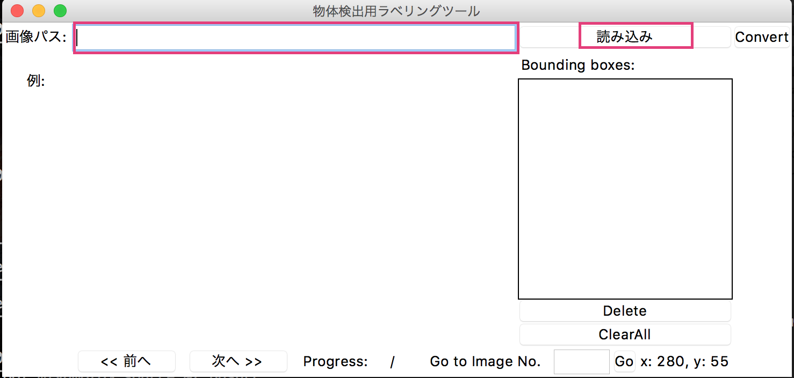
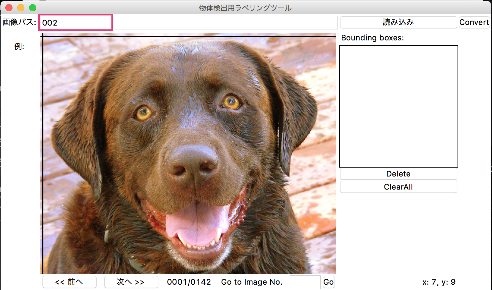
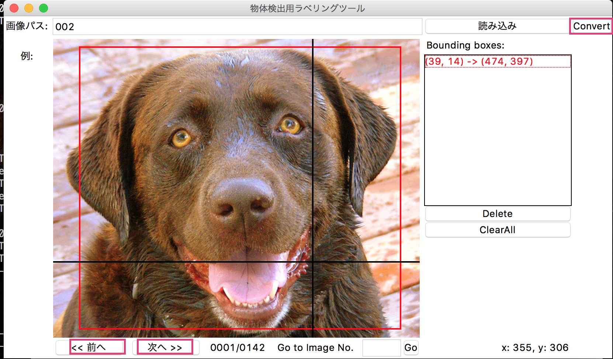
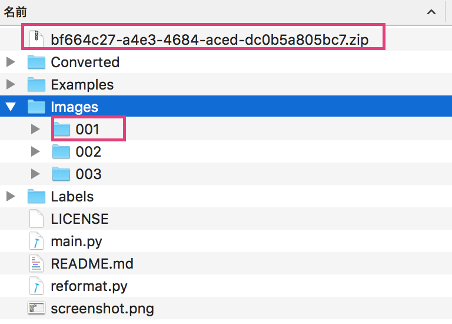

BBox-Label-Tool(改)
===============

画像のバウンディングボックスのラベリングツール。    

**初期画面:**    
画像パスにフォルダ名を入れて読み込みボタンを押下する。    


**起動後:**


**物体を囲う:**    
物体を囲ったら次へボタンか前へボタンで保存。convertボタンでyolo用のzipを吐き出す。    


**フォルダ構成:**    
convertボタン押下後に吐き出されたzipファイルとファイルパスの名前。    



ファイル構成    
-----------------
LabelTool  
|  
|--main.py   *# 実行ソース*  
|  
|--Images/   *# 画像ファイルのディレクトリ*  
|  
|--Labels/   *# ラベルファイルのディレクトリ*  
|  
|--Examples/  *# サンプルファイルのディレクトリ*  

環境    
----------
- python 3.5
- python PIL (Pillow)


```
pip install pillow
```

実行    
-------
$ python main.py

Usage
-----
/Images/001 配下に画像を /Labels/001 とパス配下にラベルを管理。    
読み込みボタンを押下。    
学習データを作成する。    
次へボタンと前へボタン押下でラベル情報を保存。    
最後にconvertボタンでzipファイルを出力。    

